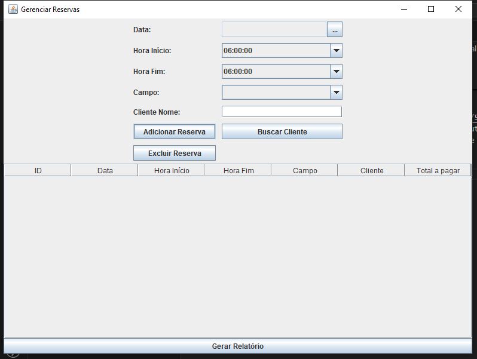

# Sistema de aluguéis de campos de futebol

## 1 - Código Fonte
Criado com o Maven e sem um arquétipo, estruturado com o método MVC (Model, View e Controller) com a pasta Repository para os testes unitários.

## 2 - Banco de Dados (Scripts SQL)
    -- Criar a tabela de clientes
    CREATE TABLE cliente (
        id SERIAL PRIMARY KEY,
        nome VARCHAR(100) NOT NULL,
        email VARCHAR(100) UNIQUE NOT NULL,
        telefone VARCHAR(15),
        tipo VARCHAR(10) CHECK (tipo IN ('ADMIN', 'USER')) NOT NULL
    );

    -- Criar a tabela de campos
    CREATE TABLE campo (
        id SERIAL PRIMARY KEY,
        nome VARCHAR(100) NOT NULL,
        disponibilidade BOOLEAN NOT NULL DEFAULT TRUE
    );

    -- Criar a tabela de reservas
    CREATE TABLE reserva (
        id SERIAL PRIMARY KEY,
        cliente_id INT REFERENCES cliente(id) ON DELETE CASCADE,
        campo_id INT REFERENCES campo(id) ON DELETE CASCADE,
        data DATE NOT NULL,
        hora_inicio TIME NOT NULL,
        hora_fim TIME NOT NULL,
        CONSTRAINT horario_unico UNIQUE (campo_id, data, hora_inicio, hora_fim)
    );

    -- Criar a tabela de relatórios
    CREATE TABLE relatorio (
        id SERIAL PRIMARY KEY,
        cliente_id INT REFERENCES cliente(id) ON DELETE CASCADE,
        campo_id INT REFERENCES campo(id) ON DELETE CASCADE,
        data DATE NOT NULL,
        hora_inicio TIME NOT NULL,
        hora_fim TIME NOT NULL
    );

## 3 - Documentação Técnica
### Diagrama de classes

### Diagrama de fluxo

### Diagrama de uso

## 4 - Manual do Usuário
- ### Instalação
    - Fazer o download e instação do [Git](https://git-scm.com/downloads)
    - Fazer o download e instalação do [Visual Studio Code](https://code.visualstudio.com/download)
    - Fazer o download e instalação do [JDK 17](https://www.oracle.com/java/technologies/javase/jdk17-archive-downloads.html)
    - Fazer o download e instalação do [PostgreSQL 16](https://www.postgresql.org/download/windows/)
    - Após instar tudo, abrir o explorador de arquivos, abrir a pasta Documentos e ir até a opção **Open Git Bash here**
    - Copiar e colar o seguinte código:

            git clone https://github.com/vigiaquinze/JavaSomativa4SEM
    - Após isso, entrar na pasta que foi criada e entrar na pasta **alugueldecamposdefutebol**, clicar com o botão direito e ir novamente até **Open Git Bash here**, ao abrir o terminal, digitar:

            code .
    - Isso vai abrir o Visual Studio Code e, ao abri-lo, você terá esta tela:

    

    - No canto esquerdo, vá até a pasta **src**, abra **main**, depois **java** e então vá até o arquivo **Main.java**.
    - Ao clicar nele, você terá esta tela:

    

    - Então, clique aqui para iniciar o programa.

    

    - Ao abrir, você terá estas funções:

    

- ### Aplicação

    - **Gerenciar Clientes**: Aqui você cadastra clientes. Cadastre os nomes com cuidado, pois depois eles serão utilizados para alugar os campos.
    - **Gerenciar Campos**: Aqui você cadastra os campos disponíveis em seu estabelecimento. Utilize nomes para facilitar a localização, como por exemplo: Campo da frente, Campo dos fundos, etc.
    - **Gerenciar Reservas**: Aqui você gerencia as reservas para os seus campos. Apenas clientes cadastrados podem alugar campos, por isso você deve ser cauteloso ao fazer cada uma das etapas.

    ### Gerenciar Clientes
    
    - Aqui você cadastra, edita e exclui seus clientes, utilizando os campos **Nome**, **Email** e **Telefone**. Você também pode alterar o tipo do cliente para um administrador, mas não é recomendável.
    - Clicando em qualquer um dos nomes cadastrados, você pode editar ou apagá-los.

    ### Gerenciar Campos
    
    - Aqui você cadastra, edita e exclui seus campos, utilizando o **Nome**, **Local** e o **Preço**, este último deve conter o preço por hora do seu campo.
    - Aqui também tem o mesmo esquema de gerenciamento de clientes, você clica em qualquer nome cadastrado na tabela e você pode editar ou apagá-los.

    ### Gerenciar Reservas
    
    - Aqui você gerencia suas reservas, selecionando o dia, a hora de início e a hora de fim da reserva. Você pode marcar por quantas horas quiser, o programa irá calcular o valor automaticamente com base no valor por hora do campo que você especificou.
    - Porém, para utilizar essa página, você deve ter campos e usuários cadastrados. Do contrário, você não conseguirá fazer nada nesta tela.
    - Aqui, clicando em uma das reservas adicionadas, você pode clicar no botão de "Gerar Relatório". O programa irá gerar um PDF com todos os dados e valor a pagar.

## 5 - Testes unitários
### Campos

### Clientes

### Reservas

## 6 - Relatórios
- Um exemplo de relatório gerado pelo programa:
    